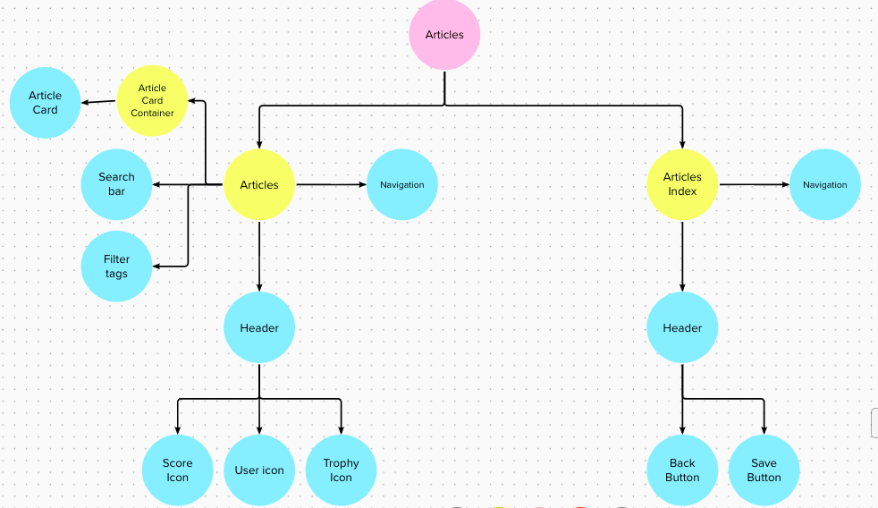

# Component Tree

Key

- yellow = pages
- blue = components

---

The project is broken down into

- [Authentication](#authentication)
- [Home](#home)
- [Pathways](#pathways)
- [Course](#course)
- [Marketplace](#marketplace)
- [Articles](#article)

<h2>App</h2>

<h2 id="authentication">Authentication</h2>

<h2 id="home">Home</h2>

<h2 id="pathways">Pathways</h2>

<h2 id="course">Course</h2>

<h2 id="marketplace">Marketplace</h2>

<h2 id="article">Article</h2>

